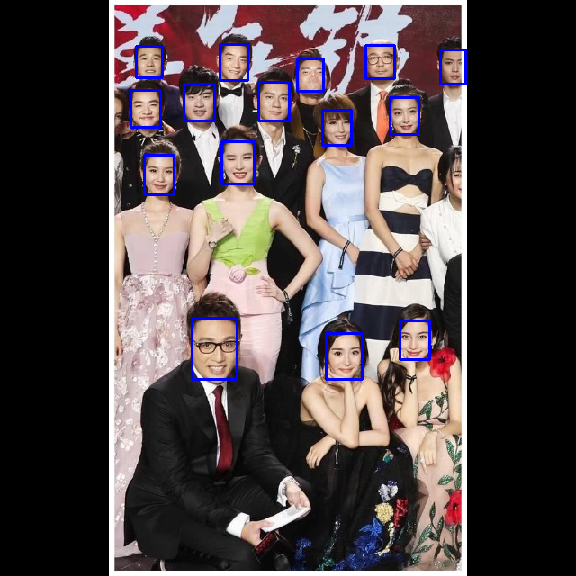

# Retina模型推理测试

- ## 工程说明

尝试将人脸检测模型放到华为Atlas设备上运行。

在编译运行中遇到任何问题，请联系：尚可 18618161912



- ## 模型说明

原始模型是基于caffe框架的，从下面地址中下载。

https://raw.githubusercontent.com/Charrin/RetinaFace-Cpp/master/convert_models/mnet/mnet.prototxt
https://raw.githubusercontent.com/Charrin/RetinaFace-Cpp/master/convert_models/mnet/mnet.caffemodel

转换模型的命令：

```shell
atc                              \
--model=./mnet.prototxt          \
--weight=./mnet.caffemodel       \
--framework=0                    \
--output=mnet                    \
--soc_version=Ascend310          \
--input_format=NCHW
```

- ## 编译方法

为了防止下面的编译步骤在您的测试环境中遇到异常，在bin目录中预置了我这边编译的结果，应该可以直接运行。

#### 编译环境（与课程中的相同）：

ubuntu18.04.4 server版， x86CPU Atlas310pcie卡 （与课程中使用的华为云服务器相同）

#### 安装软件（与课程中的相同）：

1. 驱动（步骤略）：

​	A300-3010-npu-driver_20.2.0_ubuntu18.04-x86_64.run

2. 开发工具（步骤略）：

​	Ascend-cann-nnrt_3.3.0.alpha001_linux-x86_64.run
​	Ascend-cann-toolkit_3.3.0.alpha001_linux-x86_64.run

3. opencv：参考

   [opencv编译部署过程]: https://gitee.com/ascend/samples/blob/master/cplusplus/environment/opencv_install/README_300_CN.md

#### 编译步骤

进入作业工程目录：[working dir]/canncamp/application-camp/application_riddle

```shell
mkdir build
cd build
cmake ..
make -j4
```

应该在build目录生成一个run文件。

- ## 运行方法

./run [模型文件.om] [图片文件]

输出：

1. 日志中会显示人脸框位置，基于640x640尺寸图像
2. 程序会创建一个output.png文件，图像中包含人脸框，如上图。

如：

```
./run ../model/mnet.om ../data/stars.jpg
```

- ## 版权说明

  此程序用到的模型和数据解析过程是参考了下面的开源工程：	

  https://github.com/Charrin/RetinaFace-Cpp

- ## 开发中遇到的问题：

1. 不能从模型中获取输入和输出层的名称、shape等信息。所以：

   - 这个模型有多个输出层，只能按固定顺序使用各层数据。感觉这种编码方法不太安全。

   - 只能将模型参数写死到代码中，灵活性较差。

2. aclInit函数中传入的json参数，样例和此工程中没有实际内容。

   如果有需要设置的内容，应该可以有直接传入json数据（不是文件路径）的接口，这样可以减少可执行程序在运行时对其他文件的依赖，但在头文件中没找到。

3. src目录readme要求将CMakeLists.txt文件放入其中，个人觉得工程信息还是应该放在公共区域比较合适，因此放在根目录。

