# Neoming CANN训练营第四期第四课大作业

华为云账号: Neoming

联系方式: liyiming1998@qq.com, 18918028073

## 交付件整体说明

```bash
├──imgs				# 存放README中的图片
├──Sub				# 自定义算子工程
├──SubApp			# om模型推理工程
├──SubTraining		# 含有算子的模型训练工程
└──README.md		# 本文件
```

## 运行环境说明

使用的是课程中的`ModelArts Notebook`环境，安装的`tf-plugin` 和`tensorflow`也是课程提供的，没有用其他的库

## 交付件具体说明

### 1. 自定义算子工程`Sub`

实现`Sub`算子，后续替代`tf.subtract`,

算子相关属性：

+ input0: 
  + format: ND
  + dtype: float16, float32
  + required
+ input1:
  + format: ND
  + dtype: float16, float32
  + required
+ output0:
  + format: ND
  + dtype:float16, float32
  + required

#### 1.1 工程交付件

```bash
├──CMakeLists.txt  	# cmake构建文件 （自动创建
├──build  			# 工程构建目录 （自动创建
├──build.sh  		# 工程构建脚本 （自动创建
├──cmake  			# cmake相关 （自动创建
├──cmake-build  	# cmake相关 （自动创建
├──framework  		# tf插件（涉及修改
├──op_proto  		# 算子原型定义（涉及修改
├──scripts  		# 安装脚本等等 （自动创建
└──tbe				# 算子实现（涉及修改
```


#### 1.2 具体运行

1. 使用`MindStudio`打开`Sub`算子工程
2. 选择`Python3.7.5` 解释器
3. 点击`build` -> `Edit Build Configuration` ,设置界面选择`Local Build, Linux, aarch64`

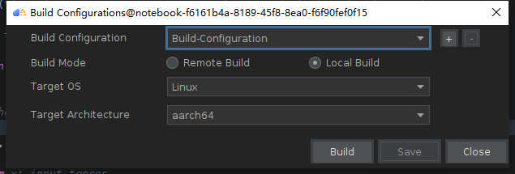

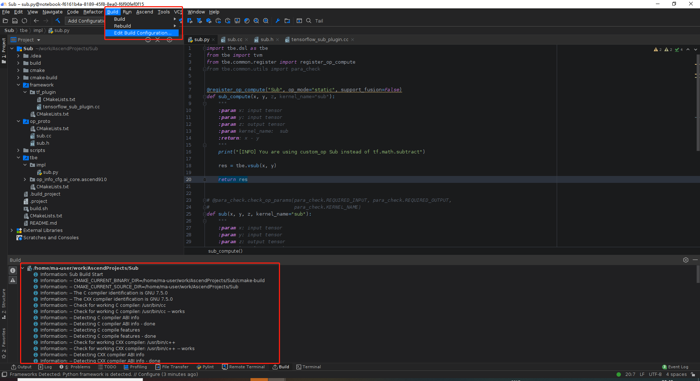


4. 点击`Ascend`->`Deploy`->`Deploy Locally`, 看到Sucess即为成功

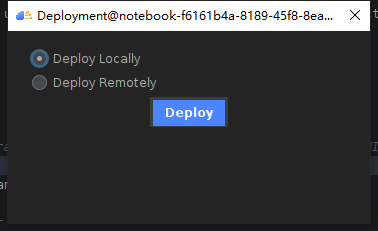

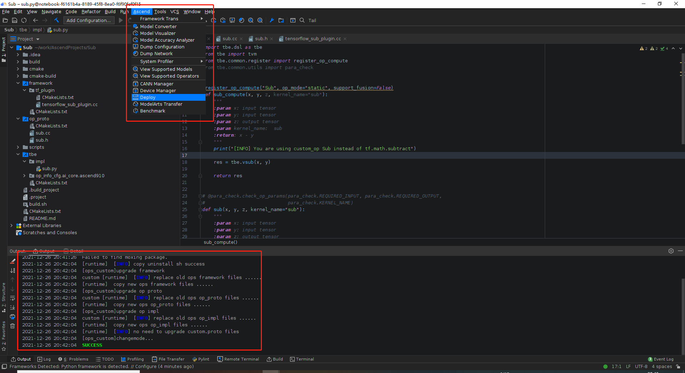

### 2. 算子训练工程`SubTraining`

#### 2.1 交付件说明

```bash
├──data					# 数据集
├──kernel_meta			# 运行时自动生成
├──models				# 含有模型对应的 ckpt，pb，om
├──pb2om.sh				# atc命令，pb转换成om
├──result_plot.png		# 模型预测结果图
├──run.sh				# 按顺序运行test_sub.py -> train.py -> pb2om.sh
├──test_sub.py			# Sub算子测试
└──train.py				# 线性回归模型训练
```


#### 2.2 具体运行

1. 使用`MindStudio`打开工程`SubTraining`
2. 点击界面左下角的`Terminal`

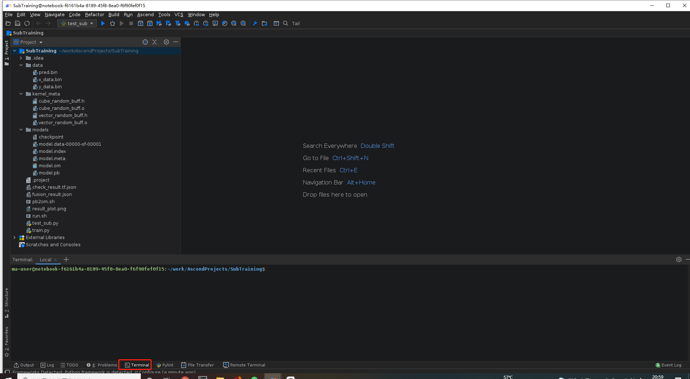

3. 运行`test_sub.py`测试`Sub`算子， 需要设置好环境变量

```bash
ma-user@notebook-f6161b4a-8189-45f8-8ea0-f6f90fef0f15:~/work/AscendProjects/SubTraining$ source ../../.bashrc 
ma-user@notebook-f6161b4a-8189-45f8-8ea0-f6f90fef0f15:~/work/AscendProjects/SubTraining$ python3.7 test_sub.py
```

得到如下输出则为算子测试通过

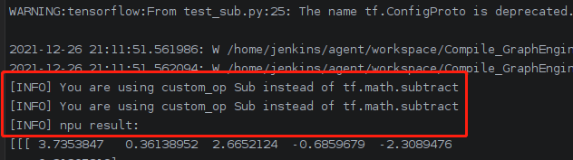

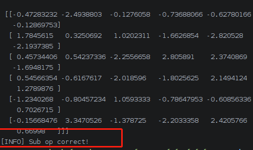

4. 运行`train.py`测试非线性回归的神经网络模型

```bash
ma-user@notebook-f6161b4a-8189-45f8-8ea0-f6f90fef0f15:~/work/AscendProjects/SubTraining$ python3.7 train.py 
```

终端输出如下，可以看到调用了自定义`Sub`算子,也成功保存了模型

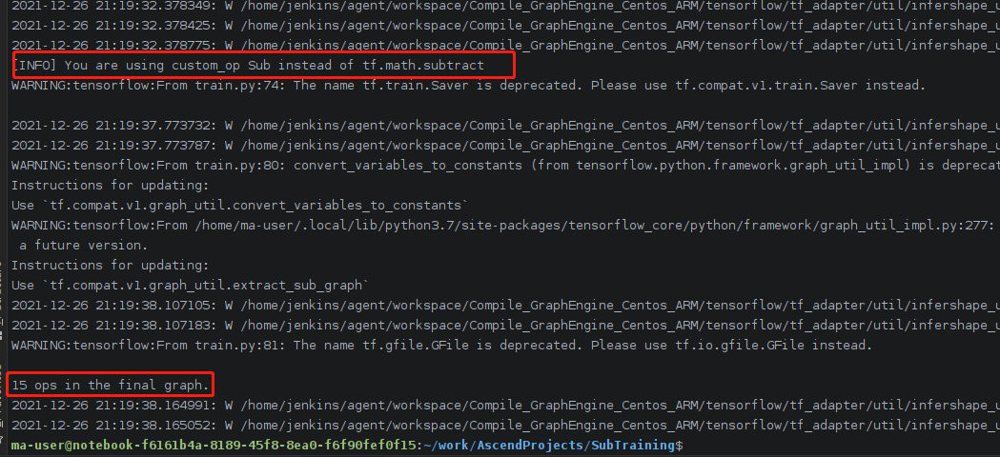

运行结束后，会在`models`目录下保存`ckpt`并转换成`pb`,`data`目录下会讲训练数据`x_data.bin`、标签数据`y_data.bin`、预测数据`pred.bin`保存，并通过`plot`库画图保存。可以看到模型效果良好。

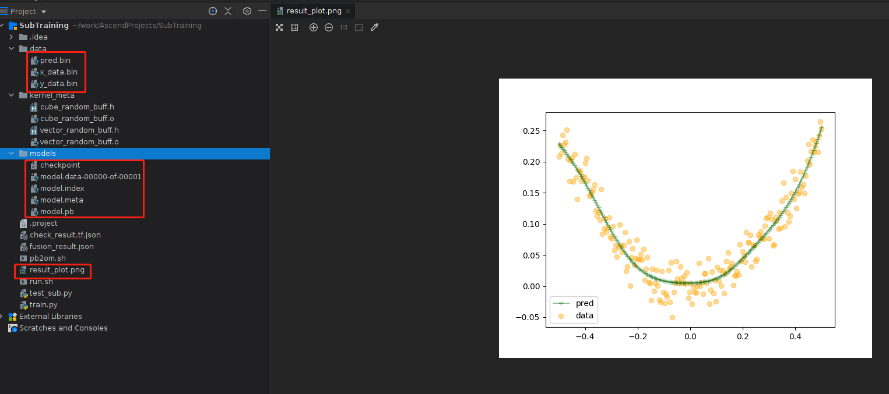

5. 运行`pb2om.sh`把`pb`转换成`om`

使用如下命令进行转换

```bash
ma-user@notebook-f6161b4a-8189-45f8-8ea0-f6f90fef0f15:~/work/AscendProjects/SubTraining$ ./pb2om.sh 
```

可以看到atc转换成功，om成功生成

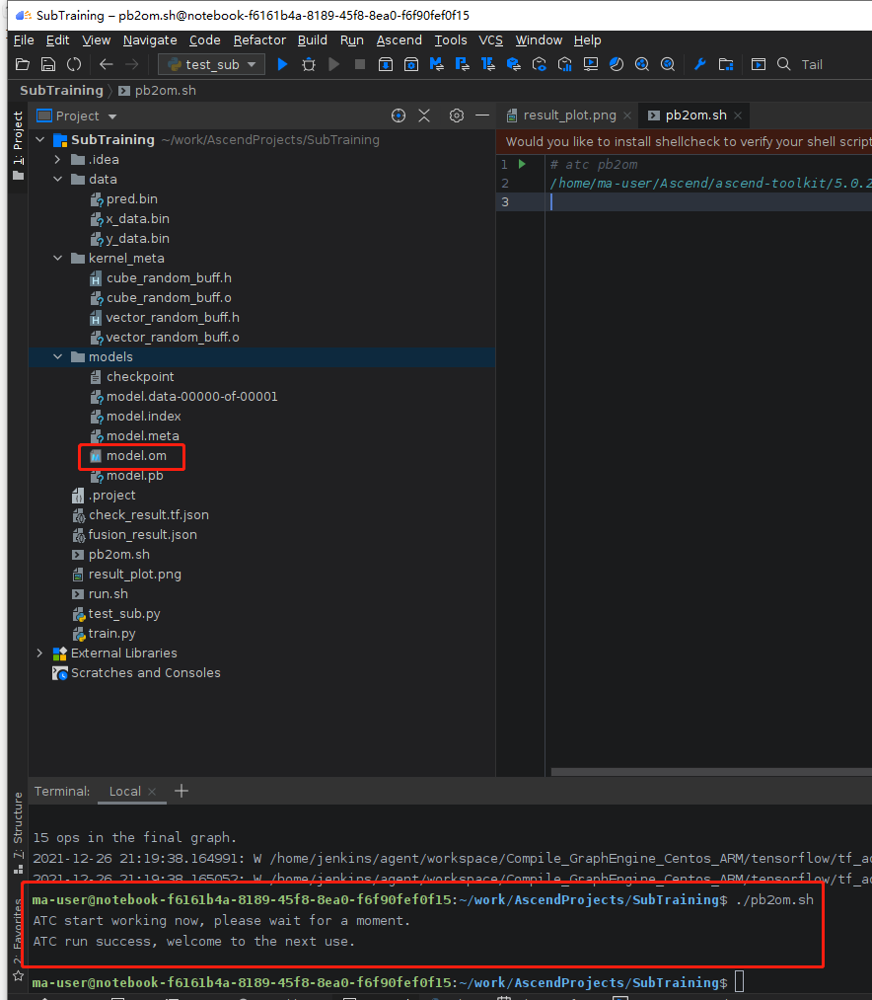

### 3. 算子推理应用工程`SubApp`

#### 3.1 交付件说明

```bash
├──CMakeLists.txt	# 工程构建文件
├──build			# 在build/cmake目录下进行cmake构建
├──data				# 推理需要的数据，我这边将训练时候的输入数据x_data.bin, ckpt模型推理结果pred.bin拷贝了过来
├──inc				# include文件，utils是直接用的仓库里面的
├──models			# om模型，我这边将训练时候导出的om拷贝了过来
├──out				# 存放C++工程编译得到的main可执行文件
├──scripts			# python脚本验证om输出的结果om_pred.bin与ckpt推理的结果pred.bin是否一致
└──src				# ACL源码文件
```

#### 3.2 具体运行

1. `MindStudio`打开`SubApp`工程

2. 从`SubTraining`中拷贝数据和om模型

命令如下,可以看到数据和模型已经成功拷贝

```bash
ma-user@notebook-f6161b4a-8189-45f8-8ea0-f6f90fef0f15:~/work/AscendProjects/SubApp$ cp ../SubTraining/data/x_data.bin data/
ma-user@notebook-f6161b4a-8189-45f8-8ea0-f6f90fef0f15:~/work/AscendProjects/SubApp$ cp ../SubTraining/data/pred.bin data/
ma-user@notebook-f6161b4a-8189-45f8-8ea0-f6f90fef0f15:~/work/AscendProjects/SubApp$ cp ../SubTraining/models/model.om models/
```

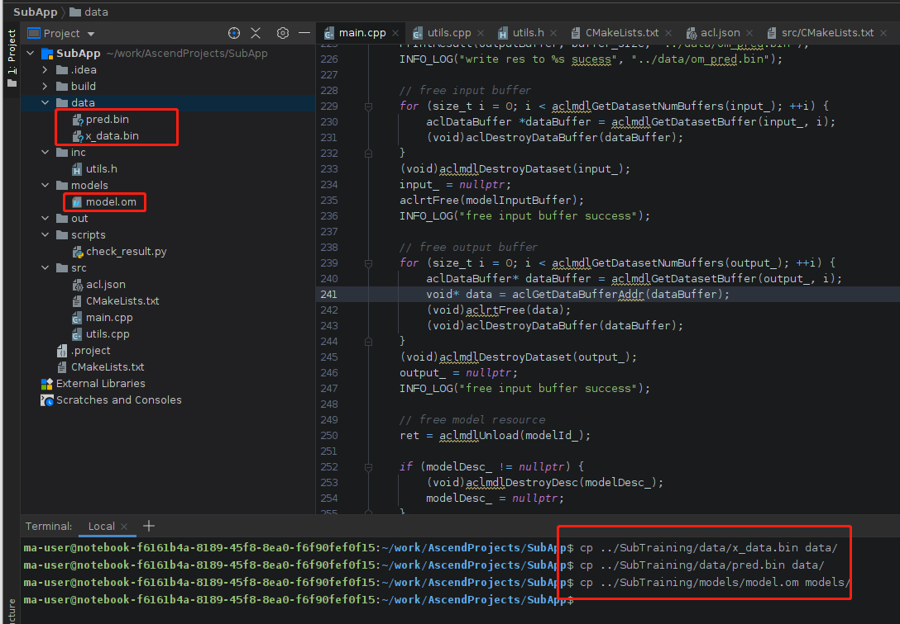

3. 构建`ACL`工程

使用如下命令进行构建

```bash
ma-user@notebook-f6161b4a-8189-45f8-8ea0-f6f90fef0f15:~/work/AscendProjects/SubApp$ cd build/cmake/
ma-user@notebook-f6161b4a-8189-45f8-8ea0-f6f90fef0f15:~/work/AscendProjects/SubApp/build/cmake$ cmake ../../
-- Configuring done
-- Generating done
-- Build files have been written to: /home/ma-user/work/AscendProjects/SubApp/build/cmake
ma-user@notebook-f6161b4a-8189-45f8-8ea0-f6f90fef0f15:~/work/AscendProjects/SubApp/build/cmake$ make
[ 33%] Linking CXX executable ../../../out/main
[100%] Built target main
ma-user@notebook-f6161b4a-8189-45f8-8ea0-f6f90fef0f15:~/work/AscendProjects/SubApp/build/cmake$ 
```


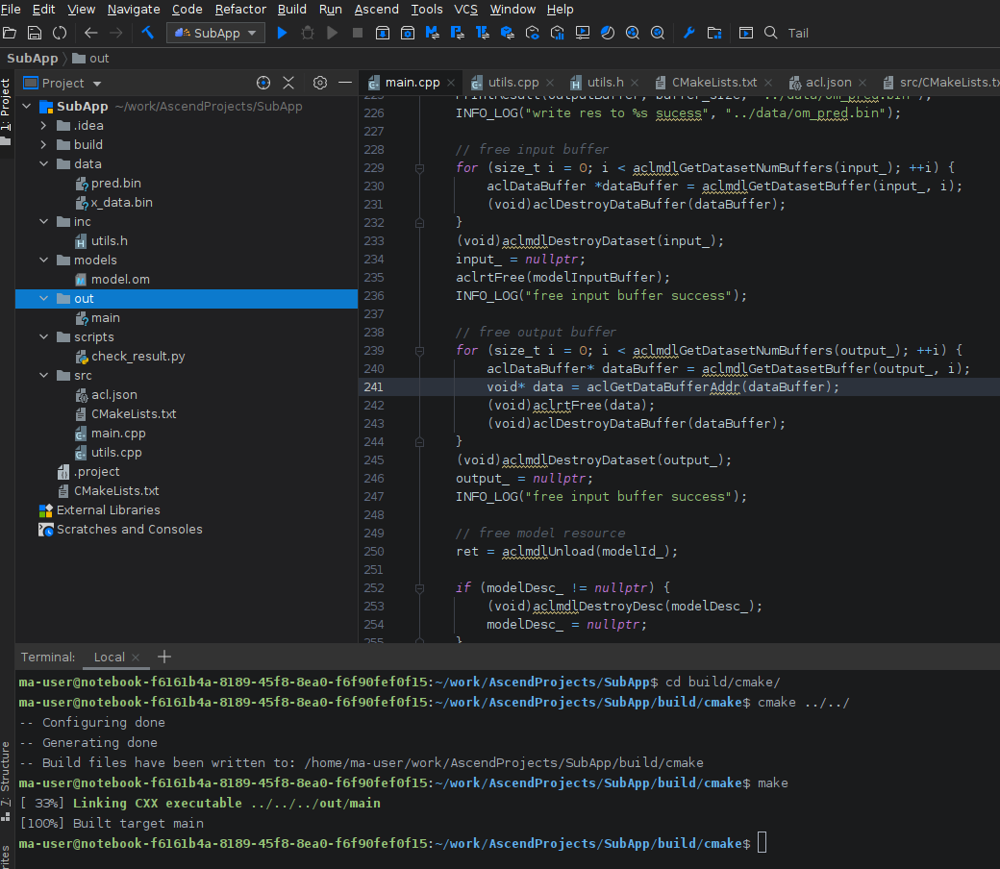

工程中，我的include是硬编码，内容如下，如果环境不一样需要修改

```bash
include_directories(
    /home/ma-user/Ascend/ascend-toolkit/5.0.2.1/acllib/include
    ../inc/
)

# add host lib path

link_directories(
    /home/ma-user/Ascend/ascend-toolkit/5.0.2.1/acllib/lib64/stub/
)
```

4. 执行`out/main`进行推理

命令如下,可以看到推理时的log输出，同时可以看到`data`目录下产生了新的`om_pred.bin`文件

```bash
ma-user@notebook-f6161b4a-8189-45f8-8ea0-f6f90fef0f15:~/work/AscendProjects/SubApp/build/cmake$ cd ../../out/
ma-user@notebook-f6161b4a-8189-45f8-8ea0-f6f90fef0f15:~/work/AscendProjects/SubApp/out$ ./main 
[INFO] acl init sucess
[INFO] acl set device sucess
[INFO] aclrt create context sucess
[INFO] aclrt create stream sucess
[INFO] aclrt get run mode sucess
[INFO] aclmdl query model size sucess
[INFO] aclrt malloc for model mem sucess
[INFO] aclrt malloc for model weight sucess
[INFO] aclmdl load from file with mem  sucess
[INFO] aclmdl create model desc sucess
[INFO] aclrt malloc for input sucess
[INFO] aclml add input buffer to dataset buffer sucess
[INFO] output buffer size is: 800
[INFO] aclrt malloc output buffer sucess
[INFO] aclmdl add output buffer to dataset sucess
[INFO] aclrt memcpy from host to device sucess
[INFO] aclmdl execute sucess
[INFO] write res to ../data/om_pred.bin sucess
[INFO] free input buffer success
[INFO] free input buffer success
[INFO] free model resource success
[INFO] free model resource success
[INFO] aclrt destroy stream success
[INFO] aclrt reset device success
[INFO] acl finalize success
```

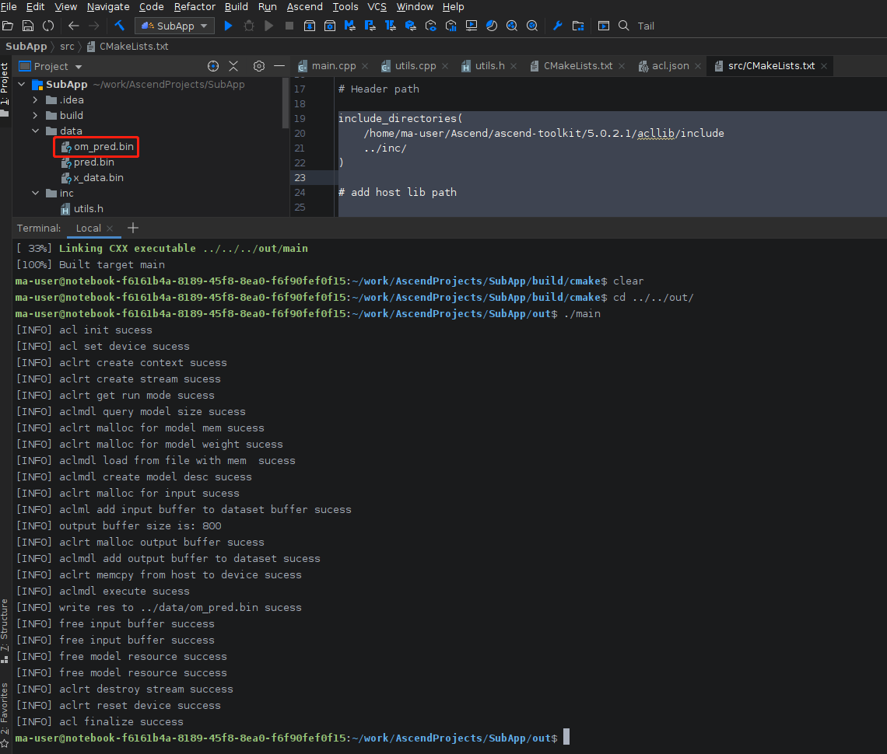

5. 使用`scripts`目录下的`check_result.py`比较`om`模型的输出`om_pred.bin`与·`ckpt`的输出文件`pred.bin`

命令如下，可以看到om的输出满足要求

```bash
ma-user@notebook-f6161b4a-8189-45f8-8ea0-f6f90fef0f15:~/work/AscendProjects/SubApp/out$ cd ../scripts/
ma-user@notebook-f6161b4a-8189-45f8-8ea0-f6f90fef0f15:~/work/AscendProjects/SubApp/scripts$ python3.7 check_result.py 
[INFO] om output correct
```

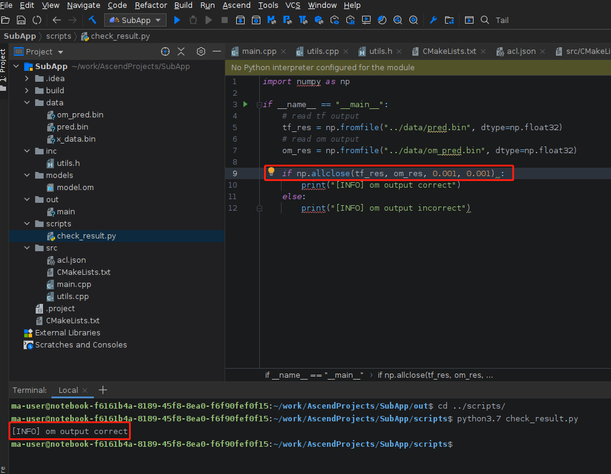

